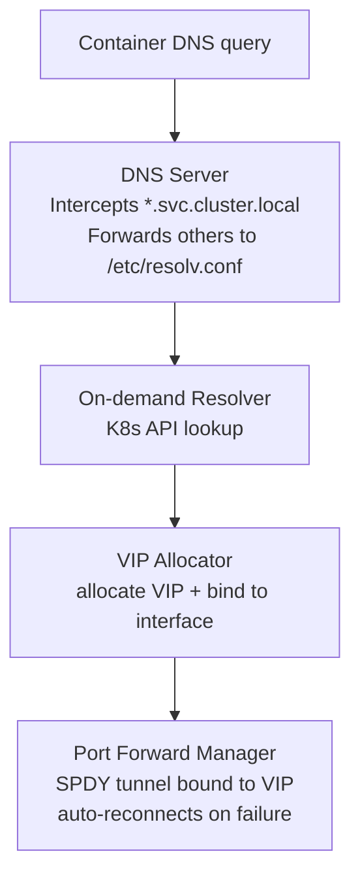

# kube-forwarding-proxy

A Go-based Kubernetes service proxy sidecar for Docker Compose stacks. It allows containers in a Compose stack to resolve and access Kubernetes Services as if they were running inside the cluster.

## How it works

1. **DNS interception** — An embedded DNS server listens on port 53 (UDP + TCP). Queries for `*.svc.cluster.local` are handled locally; all other queries are forwarded to the upstream servers in `/etc/resolv.conf`.
2. **On-demand resolution** — The first DNS query for a service triggers a Kubernetes API lookup to discover the service's endpoints and ports.
3. **VIP allocation** — The service is assigned a virtual IP from a private CIDR range (`127.0.0.0/8` by default), bound to the configured network interface. The VIP is returned as the DNS response.
4. **Port-forward tunneling** — For each service port a persistent SPDY tunnel is opened directly to a backing pod via the Kubernetes API server's port-forward endpoint (`/api/v1/namespaces/<ns>/pods/<pod>/portforward`). The tunnel listens **directly on the VIP address** and auto-reconnects with exponential backoff if it drops.
5. **SOCKS5 proxy** (optional) — A SOCKS5 server intercepts connections whose hostname ends in `.svc.cluster.local`, resolves and allocates a VIP on-demand, and tunnels the connection through port-forward. Non-cluster traffic is dialled directly. Clients can use `ALL_PROXY` or per-app SOCKS5 settings instead of custom DNS.

Both service-level (`<svc>.<ns>.svc.cluster.local`) and pod-level (`<pod>.<svc>.<ns>.svc.cluster.local`) addressing are supported for headless services.

## Architecture



## Project Structure

```
cmd/proxy/main.go           — Entrypoint
internal/config/            — Configuration from environment variables
internal/dns/               — Embedded DNS server (intercepts *.svc.cluster.local)
internal/health/            — HTTP health server (/healthz, /readyz)
internal/vip/               — Virtual IP allocator from a private CIDR range
internal/k8s/               — Kubernetes client, service resolver, port-forward tunneling
internal/proxy/             — TCP proxy listeners & SOCKS5 proxy
tests/e2e/                  — End-to-end tests
```

## Configuration

All configuration is via environment variables:

| Variable | Default | Description |
| --- | --- | --- |
| `KUBECONFIG` | `/root/.kube/config` | Path to kubeconfig file |
| `INTERFACE` | `127.0.0.1` | Interface name (e.g. `eth0`) or IP address the DNS/SOCKS servers bind to. VIPs are also added to this interface. |
| `VIP_CIDR` | `127.0.0.0/8` | CIDR range for virtual IPs |
| `CLUSTER_DOMAIN` | `svc.cluster.local` | Kubernetes cluster domain |
| `LOG_LEVEL` | `info` | Log level (`debug`, `info`, `warn`, `error`) |
| `HTTP_LISTEN` | `127.0.0.1:8080` | Control server listen address |
| `DNS_LISTEN` | `127.0.0.1:0` | DNS server listen address |
| `SOCKS_LISTEN` | `127.0.0.1:0` | SOCKS5 server listen address |

## Control endpoints

The proxy exposes a lightweight HTTP server (default `:8080`):

| Endpoint | Description |
| --- | --- |
| `GET /healthz` | Liveness probe — returns `200` once the server is up |
| `GET /readyz` | Readiness probe — returns `200` after the proxy is fully initialised, `503` before |
| `GET /kubeconfig` | Return the merged active kubeconfig (file + dynamic) as YAML |
| `PUT /kubeconfig` | Replace the dynamic kubeconfig entirely |
| `POST /kubeconfig` | Append clusters/contexts/users (fails `409` on name conflicts) |
| `PATCH /kubeconfig` | Merge-with-overwrite (same as POST but overwrites duplicates) |
| `DELETE /kubeconfig` | Clear the dynamic kubeconfig and tear down active tunnels |

## Kubeconfig Management API

The `/kubeconfig` endpoint lets you hot-reload cluster credentials at runtime without restarting the proxy. All state is **in-memory only** — changes are not written back to the kubeconfig file and are lost on restart.

### Multi-context routing

When multiple contexts are loaded you can target a specific cluster in DNS by appending the context name as an extra label:

```
# Routes to the current-context (default behaviour)
my-service.default.svc.cluster.local

# Routes to the context named "staging"
my-service.default.svc.cluster.local.staging
```

The same suffix syntax works in the SOCKS5 proxy.

### GET /kubeconfig

Returns the full merged kubeconfig (file-on-disk merged with any dynamically loaded config) as `application/yaml`.

```bash
curl http://localhost:8080/kubeconfig
```

Response: `200 OK` with a kubeconfig YAML body.

### PUT /kubeconfig

Replaces the in-memory dynamic config entirely. The body must be a valid kubeconfig YAML. Existing tunnels for removed contexts are torn down and new clientsets are built immediately.

```bash
curl -X PUT http://localhost:8080/kubeconfig \
  -H "Content-Type: application/yaml" \
  --data-binary @/path/to/kubeconfig.yaml
```

| Status | Meaning |
| --- | --- |
| `204 No Content` | Config replaced successfully |
| `400 Bad Request` | Body is missing or not a valid kubeconfig |

### POST /kubeconfig

Appends clusters, contexts, and users from the request body into the existing in-memory config. Fails if any name in the request already exists in the active config (including the file-based config).

```bash
curl -X POST http://localhost:8080/kubeconfig \
  -H "Content-Type: application/yaml" \
  --data-binary @/path/to/extra-clusters.yaml
```

| Status | Meaning |
| --- | --- |
| `204 No Content` | Config appended successfully |
| `400 Bad Request` | Body is missing or not a valid kubeconfig |
| `409 Conflict` | One or more cluster/context/user names already exist; body lists the conflicting names |

### PATCH /kubeconfig

Like `POST`, but overlapping names are overwritten instead of rejected.

```bash
curl -X PATCH http://localhost:8080/kubeconfig \
  -H "Content-Type: application/yaml" \
  --data-binary @/path/to/updated-clusters.yaml
```

| Status | Meaning |
| --- | --- |
| `204 No Content` | Config merged successfully |
| `400 Bad Request` | Body is missing or not a valid kubeconfig |

### DELETE /kubeconfig

Clears all dynamically loaded config and shuts down any active port-forward tunnels associated with dynamic contexts. The file-based kubeconfig (from `KUBECONFIG`) is re-applied on the next request.

```bash
curl -X DELETE http://localhost:8080/kubeconfig
```

Response: `204 No Content`.

## Command-line flags

Which servers to run is controlled by CLI flags rather than environment variables:

| Flag | Description |
| --- | --- |
| *(no flags)* | Enable DNS server only (default) |
| `--dns` | Enable DNS server |
| `--socks` | Enable SOCKS5 proxy |

## Build

```bash
CGO_ENABLED=0 go build -o k8s-service-proxy ./cmd/proxy
```

## Docker

```bash
docker build -t k8s-service-proxy .
```

## Usage with Docker Compose

```yaml
services:
  k8s-proxy:
    build: .
    cap_add:
      - NET_ADMIN
    volumes:
      # Optionally mount an existing kubeconfig
      - ~/.kube/config:/root/.kube/config:ro
    environment:
      # Allocate Virtual IPs in the 172.28.1.0-255 range
      VIP_CIDR: 172.28.1.0/24
      # Interface to allocate Virtual IPs on
      INTERFACE: 172.28.0.10
      # Bind the DNS server to 0.0.0.0:53
      DNS_LISTEN: :53
    command: ["--dns"]
    networks:
      app-net:
        ipv4_address: 172.28.0.10

  my-app:
    image: my-app:latest
    dns:
      - 172.28.0.10
    networks:
      - app-net

networks:
  app-net:
    ipam:
      config:
        - subnet: 172.28.0.0/16
          # let Docker allocate container IPs only in 172.28.0.* so it doesn't conflict with proxy IPs in 172.28.1.*
          ip_range: 172.28.0.0/24
```

Containers using `dns: [172.28.0.10]` can then resolve Kubernetes services:

```bash
# From inside my-app container
curl http://my-service.default.svc.cluster.local:8080/health
```

### SOCKS5 Proxy (Alternative)

If you prefer SOCKS5 over custom DNS + VIP, add `--socks` to the proxy command and configure clients with `ALL_PROXY`:

```yaml
  k8s-proxy:
    # ...
    environment:
      SOCKS_LISTEN: :1080
    command: ["--socks"]   # DNS-only is the default; --socks enables SOCKS5 only

  my-app:
    environment:
      - ALL_PROXY=socks5://172.28.0.10:1080
```

To run both simultaneously:

```yaml
    command: ["--dns", "--socks"]
```

The SOCKS5 proxy routes `*.svc.cluster.local` destinations through the K8s port-forward API and dials everything else directly.

## Testing

Unit tests:

```bash
go test ./internal/...
```

End-to-end tests (spin up a real kind cluster for each test):

```bash
./tests/e2e/run.sh
```

## Requirements

- Go 1.26+
- `NET_ADMIN` capability (for binding VIPs to a network interface)
- A valid kubeconfig with access to the target cluster

## License

MIT
