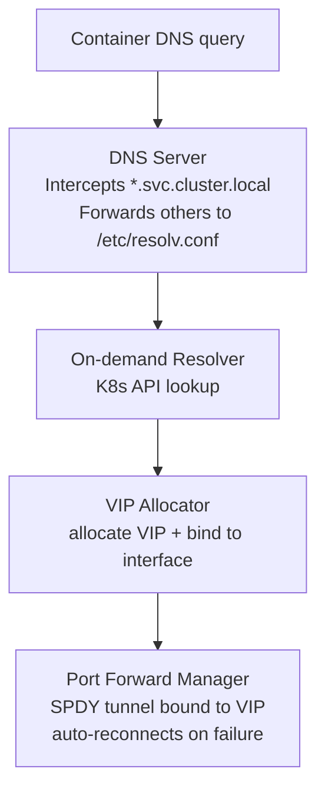

# kube-forwarding-proxy

A Go-based Kubernetes service proxy sidecar for Docker Compose stacks. It allows containers in a Compose stack to resolve and access Kubernetes Services as if they were running inside the cluster.

## How it works

1. **DNS interception** — An embedded DNS server listens on port 53 (UDP + TCP). Queries for `*.svc.cluster.local` are handled locally; all other queries are forwarded to the upstream servers in `/etc/resolv.conf`.
2. **On-demand resolution** — The first DNS query for a service triggers a Kubernetes API lookup to discover the service's endpoints and ports.
3. **VIP allocation** — The service is assigned a virtual IP from a private CIDR range (`127.0.0.0/8` by default), bound to the configured network interface. The VIP is returned as the DNS response.
4. **Port-forward tunneling** — For each service port a persistent SPDY tunnel is opened directly to a backing pod via the Kubernetes API server's port-forward endpoint (`/api/v1/namespaces/<ns>/pods/<pod>/portforward`). The tunnel listens **directly on the VIP address** and auto-reconnects with exponential backoff if it drops.
5. **SOCKS5 proxy** (optional) — A SOCKS5 server intercepts connections whose hostname ends in `.svc.cluster.local`, resolves and allocates a VIP on-demand, and tunnels the connection through port-forward. Non-cluster traffic is dialled directly. Clients can use `ALL_PROXY` or per-app SOCKS5 settings instead of custom DNS.

Both service-level (`<svc>.<ns>.svc.cluster.local`) and pod-level (`<pod>.<svc>.<ns>.svc.cluster.local`) addressing are supported for headless services.

## Architecture



## Project Structure

```
cmd/proxy/main.go           — Entrypoint
internal/config/            — Configuration from environment variables
internal/dns/               — Embedded DNS server (intercepts *.svc.cluster.local)
internal/health/            — HTTP health server (/healthz, /readyz)
internal/vip/               — Virtual IP allocator from a private CIDR range
internal/k8s/               — Kubernetes client, service resolver, port-forward tunneling
internal/proxy/             — TCP proxy listeners & SOCKS5 proxy
tests/e2e/                  — End-to-end tests
```

## Configuration

All configuration is via environment variables:

| Variable | Default | Description |
| --- | --- | --- |
| `KUBECONFIG` | `/root/.kube/config` | Path to kubeconfig file |
| `INTERFACE` | `lo0` | Interface name (e.g. `eth0`) or IP address the DNS/SOCKS servers bind to. VIPs are also added to this interface. |
| `VIP_CIDR` | `127.50.0.0/24` | CIDR range for virtual IPs |
| `CLUSTER_DOMAIN` | `svc.cluster.local` | Kubernetes cluster domain |
| `LOG_LEVEL` | `info` | Log level (`debug`, `info`, `warn`, `error`) |
| `HTTP_LISTEN` | `127.0.0.1:11616` | Control server listen address |
| `DNS_LISTEN` | `127.0.0.1:11617` | DNS server listen address |
| `SOCKS_LISTEN` | `127.0.0.1:11618` | SOCKS5 server listen address |
| `VIP_IDLE_TIMEOUT` | `0` | The idle duration after which to release an allocated virtual IP. `0` disables the idle timeout. |
| `VIP_ALIAS_MODE` | `preallocated` | How VIPs are bound to the interface. `preallocated` (default) assumes the VIPs are already aliased — set up once by `k8s-service-proxy install`. `auto` calls `ifconfig`/netlink per allocation; required for the docker-compose sidecar deployment, which runs with `NET_ADMIN` and aliases at runtime. |

## Control endpoints

The proxy exposes a lightweight HTTP server (default `:8080`):

| Endpoint | Description |
| --- | --- |
| `GET /healthz` | Liveness probe — returns `200` once the server is up |
| `GET /readyz` | Readiness probe — returns `200` after the proxy is fully initialised, `503` before |
| `GET /kubeconfig` | Return the merged active kubeconfig (file + dynamic) as YAML |
| `PUT /kubeconfig` | Replace the dynamic kubeconfig entirely |
| `POST /kubeconfig` | Append clusters/contexts/users (fails `409` on name conflicts) |
| `PATCH /kubeconfig` | Merge-with-overwrite (same as POST but overwrites duplicates) |
| `DELETE /kubeconfig` | Clear the dynamic kubeconfig and tear down active tunnels |

## Kubeconfig Management API

The `/kubeconfig` endpoint lets you hot-reload cluster credentials at runtime without restarting the proxy. All state is **in-memory only** — changes are not written back to the kubeconfig file and are lost on restart.

### Multi-context routing

When multiple contexts are loaded you can target a specific cluster in DNS by appending the context name as an extra label:

```
# Routes to the current-context (default behaviour)
my-service.default.svc.cluster.local

# Routes to the context named "staging"
my-service.default.svc.cluster.local.staging
```

The same suffix syntax works in the SOCKS5 proxy.

### GET /kubeconfig

Returns the full merged kubeconfig (file-on-disk merged with any dynamically loaded config) as `application/yaml`.

```bash
curl http://localhost:8080/kubeconfig
```

Response: `200 OK` with a kubeconfig YAML body.

### PUT /kubeconfig

Replaces the in-memory dynamic config entirely. The body must be a valid kubeconfig YAML. Existing tunnels for removed contexts are torn down and new clientsets are built immediately.

```bash
curl -X PUT http://localhost:8080/kubeconfig \
  -H "Content-Type: application/yaml" \
  --data-binary @/path/to/kubeconfig.yaml
```

| Status | Meaning |
| --- | --- |
| `204 No Content` | Config replaced successfully |
| `400 Bad Request` | Body is missing or not a valid kubeconfig |

### POST /kubeconfig

Appends clusters, contexts, and users from the request body into the existing in-memory config. Fails if any name in the request already exists in the active config (including the file-based config).

```bash
curl -X POST http://localhost:8080/kubeconfig \
  -H "Content-Type: application/yaml" \
  --data-binary @/path/to/extra-clusters.yaml
```

| Status | Meaning |
| --- | --- |
| `204 No Content` | Config appended successfully |
| `400 Bad Request` | Body is missing or not a valid kubeconfig |
| `409 Conflict` | One or more cluster/context/user names already exist; body lists the conflicting names |

### PATCH /kubeconfig

Like `POST`, but overlapping names are overwritten instead of rejected.

```bash
curl -X PATCH http://localhost:8080/kubeconfig \
  -H "Content-Type: application/yaml" \
  --data-binary @/path/to/updated-clusters.yaml
```

| Status | Meaning |
| --- | --- |
| `204 No Content` | Config merged successfully |
| `400 Bad Request` | Body is missing or not a valid kubeconfig |

### DELETE /kubeconfig

Clears all dynamically loaded config and shuts down any active port-forward tunnels associated with dynamic contexts. The file-based kubeconfig (from `KUBECONFIG`) is re-applied on the next request.

```bash
curl -X DELETE http://localhost:8080/kubeconfig
```

Response: `204 No Content`.

## Command-line flags

Which servers to run is controlled by CLI flags rather than environment variables:

| Flag | Description |
| --- | --- |
| *(no flags)* | Enable DNS server only (default) |
| `--dns` | Enable DNS server |
| `--socks` | Enable SOCKS5 proxy |

## Build

```bash
CGO_ENABLED=0 go build -o k8s-service-proxy ./cmd/proxy
```

## Docker

```bash
docker build -t k8s-service-proxy .
```

## Usage with Docker Compose

```yaml
services:
  k8s-proxy:
    build: .
    cap_add:
      - NET_ADMIN
    volumes:
      # Optionally mount an existing kubeconfig
      - ~/.kube/config:/root/.kube/config:ro
    environment:
      # Allocate Virtual IPs in the 172.28.1.0-255 range
      VIP_CIDR: 172.28.1.0/24
      # Interface to allocate Virtual IPs on
      INTERFACE: 172.28.0.10
      # Bind the DNS server to 0.0.0.0:53
      DNS_LISTEN: :53
      # NET_ADMIN container; alias VIPs at runtime instead of expecting them
      # to be pre-aliased.
      VIP_ALIAS_MODE: auto
    command: ["--dns"]
    networks:
      app-net:
        ipv4_address: 172.28.0.10

  my-app:
    image: my-app:latest
    dns:
      - 172.28.0.10
    networks:
      - app-net

networks:
  app-net:
    ipam:
      config:
        - subnet: 172.28.0.0/16
          # let Docker allocate container IPs only in 172.28.0.* so it doesn't conflict with proxy IPs in 172.28.1.*
          ip_range: 172.28.0.0/24
```

Containers using `dns: [172.28.0.10]` can then resolve Kubernetes services:

```bash
# From inside my-app container
curl http://my-service.default.svc.cluster.local:8080/health
```

### SOCKS5 Proxy (Alternative)

If you prefer SOCKS5 over custom DNS + VIP, add `--socks` to the proxy command and configure clients with `ALL_PROXY`:

```yaml
  k8s-proxy:
    # ...
    environment:
      SOCKS_LISTEN: :1080
    command: ["--socks"]   # DNS-only is the default; --socks enables SOCKS5 only

  my-app:
    environment:
      - ALL_PROXY=socks5://172.28.0.10:1080
```

To run both simultaneously:

```yaml
    command: ["--dns", "--socks"]
```

The SOCKS5 proxy routes `*.svc.cluster.local` destinations through the K8s port-forward API and dials everything else directly.

## Running on macOS

The DNS+VIP path on macOS needs two privileged actions: writing
`/etc/resolver/<cluster-domain>` so the system routes cluster DNS to the proxy,
and aliasing the VIP addresses onto `lo0` so the proxy can bind on them. Both
are folded into the binary's `install` subcommand. Daily operation runs
unprivileged.

### One-time install

```bash
go build -o k8s-service-proxy ./cmd/proxy

./k8s-service-proxy install         # plans the changes; if anything is needed,
                                    # prints a copy-paste sudo snippet and exits 1
./k8s-service-proxy install         # re-run after the snippet to verify; exits 0
                                    # with "already up to date" + status report
./k8s-service-proxy status          # check install + daemon state any time

./k8s-service-proxy install --pool-size 64    # plan a smaller pool
./k8s-service-proxy install --dns-port 5354   # plan a different DNS port
./k8s-service-proxy uninstall                 # reverse the install
./k8s-service-proxy install --help            # full flag list
```

`status` reports whether the resolver file and `lo0` pool are aligned with
expected values, and whether the daemon's HTTP control plane is reachable on
its configured port. When the daemon isn't running, it prints the exact
command to start it (env-prefixed when install used non-default flags).

The install command never escalates by itself. When run as a non-root user it
prints exactly what would change, the `sudo` shell snippet to apply it, and the
verification re-run. Re-running after applying the snippet recomputes the diff
and exits 0 once the live state matches what the binary expects.

Defaults:

| Setting | Default | Notes |
| --- | --- | --- |
| Cluster domain | `svc.cluster.local` | `install` writes `/etc/resolver/<domain>`; macOS longest-suffix match still lets you carve sub-domains later. |
| DNS port | `11617` | Where the daemon listens; macOS resolver routes `*.<cluster-domain>` queries here. |
| VIP CIDR | `127.50.0.0/24` | Loopback subnet aliased to `lo0`. |
| Pool size | `255` | `127.50.0.1`–`127.50.0.255`. On loopback no L2 broadcast applies, so the `.255` address is fine to alias and use. One VIP per concurrent unique `(context, namespace, service[, pod])` tuple. |

**Reboot persistence.** `ifconfig` aliases on macOS live in kernel memory only —
they vanish on reboot. Re-run `./k8s-service-proxy install` after each reboot
(it is idempotent, ~1–2 s) or wire it into a login item.

### Run the daemon

The daemon's defaults match what `install` configures, so no env vars are
needed on a freshly-installed macOS host:

```bash
./k8s-service-proxy                # DNS server + control plane (default)
./k8s-service-proxy --dns --socks  # DNS + SOCKS5 (port 11618)
./k8s-service-proxy --socks        # SOCKS5 only — no DNS
```

The daemon binds `127.0.0.1:11616` (control), `127.0.0.1:11617` (DNS), and
`127.0.0.1:11618` (SOCKS, when enabled) by default — same ports `install` wrote
into `/etc/resolver/<cluster-domain>` and the VIP pool is keyed against. If you
ran `install` with non-default flags (e.g. `--dns-port 5354`), the
`install` command's run hint shows the matching env-var overrides.

### Why a VIP pool, not a single VIP

Each port-forward listener binds `(VIP, servicePort)`. Two services on the same
port collide on a single VIP — e.g. `svc-a.ns-a.svc.cluster.local:80` and
`svc-b.ns-b.svc.cluster.local:80` both try to listen on `127.0.0.1:80`. Generic
TCP carries no destination-hostname signal that would let one listener
demultiplex by name (HTTP `Host`, TLS SNI, and SOCKS5 do, but only their
respective protocols). For a port-collision-free environment one VIP suffices;
otherwise pre-allocate enough VIPs to cover concurrent unique services. If you
exhaust the pool, re-run the installer with a larger `--pool-size` (and
optionally set `VIP_IDLE_TIMEOUT` so unused VIPs return to the pool).

Pod-level addressing (`<pod>.<svc>.<ns>.svc.cluster.local`) allocates a separate
VIP per pod, so a 30-pod sharded workload consumes 30 VIPs from the pool. The
default `/24` (255 usable) covers ~8 such workloads concurrently across every
registered context combined.

The SOCKS5 mode (see [SOCKS5 Proxy](#socks5-proxy-alternative)) uses no VIPs at
all — the client tells the proxy the destination hostname, so name-based
dispatch happens at the SOCKS layer. It works for any TCP traffic but only with
clients that honor `ALL_PROXY` or system SOCKS settings.

## Multi-cluster registration via the kubeconfig API

The `/kubeconfig` endpoint lets external clients (CI scripts, dev workflows,
sidecar containers) register cluster contexts at runtime. The DNS handler
fanout in `internal/dns/server.go` already iterates every loaded context per
query, so a bare cluster FQDN unambiguously resolves whenever exactly one
context owns the queried namespace. One piece of discipline makes this scale
to many simultaneously-loaded clusters: **set `proxy-url` per cluster** in the
kubeconfig fragment so the daemon tunnels each context's API + SPDY traffic
through the right path. Any scheme `client-go` accepts works (`http://`,
`https://`, `socks5://`).

Name collisions across registrants — e.g. parallel devcontainers that all use
the kind-default context name `kind-kind` — are handled server-side. On every
PUT/POST/PATCH the daemon suffixes every cluster, context, and auth-info name
with the cluster's `proxy-url` port before merge. Each worktree runs its own
SOCKS/HTTP-CONNECT tunnel on a distinct local port, so `kind-kind` from a
worktree on `:8026` becomes `kind-kind-8026` and the same name from a worktree
on `:8027` becomes `kind-kind-8027` — both stay addressable. Identity is
`(original-name, proxy-port)`: re-registering the same tuple PATCH-overwrites
the previous entry, which is the eviction story when a kind cluster gets
recreated under the same tunnel (fresh CA, fresh apiserver port, single entry).
Configs whose clusters have no `proxy-url` pass through unchanged, preserving
the legacy overwrite behaviour for simple single-cluster setups. The rewrite
is idempotent — already-suffixed names are a no-op.

Example fragment a registrant `PATCH`es:

```yaml
clusters:
  - name: wt-22-evg
    cluster:
      server: https://127.0.0.1:6443
      proxy-url: socks5://127.0.0.1:1081
      certificate-authority-data: ...
contexts:
  - name: wt-22-evg
    context: { cluster: wt-22-evg, user: wt-22-evg }
users:
  - name: wt-22-evg
    user: { client-certificate-data: ..., client-key-data: ... }
```

```bash
curl -X PATCH \
  -H 'Content-Type: application/yaml' \
  --data-binary @fragment.yaml \
  http://127.0.0.1:11616/kubeconfig
```

Best-effort registration from another container that wants to reach the host
daemon on macOS goes via Docker's `host.docker.internal`:

```bash
curl --max-time 2 -fsS -X PATCH \
  -H 'Content-Type: application/yaml' \
  --data-binary @fragment.yaml \
  http://host.docker.internal:11616/kubeconfig \
  || echo "host kfp not reachable; skipping registration"
```

For collision cases — same namespace+service across multiple registered
clusters — use the context-suffix FQDN form
`<svc>.<ns>.svc.cluster.local.<context-name>` to target one specific cluster.
The context name to use is the *registered* (prefixed) name, which `register`
prints after a successful submission and `status` shows under "Registered
contexts (from /kubeconfig)".

## Testing

Unit tests:

```bash
go test ./internal/...
```

End-to-end tests (spin up a real kind cluster for each test):

```bash
./tests/e2e/run.sh
```

## Requirements

- Go 1.26+
- `NET_ADMIN` capability (for binding VIPs to a network interface)
- A valid kubeconfig with access to the target cluster

## License

MIT
